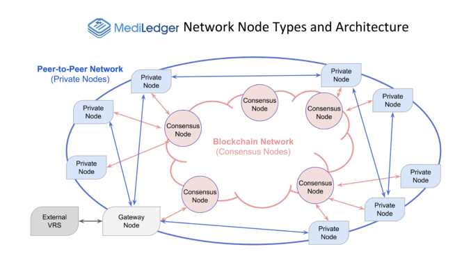

# Blockchain Technology in the Pharmaceutical Supply Chain
## Researched Company: Chronicled
 [Link to Chronicled's Website](https://www.chronicled.com/)
### *by Yoko Yammamoto*

--------

## Overview and Origin 
Blockchain technology is widely known as the technology used for cryptocurrencies. 

  > Quote: Blockchain is a decentralized, distributed, and oftentimes public, digital ledger consisting of records called blocks that is used to record transactions across many computers so that any involved block cannot be altered retroactively, without the alteration of all subsequent blocks. This allows the participants to verify and audit transactions independently and relatively inexpensively. (Wikipedia)

That technology has started being applied to variety of areas in our lives such as property transactions, voting process, virtual assets in the gaming industry, and supply chain management. In this research project, I chose a company named, Chronicled which utilizes blockchain technology for the supply chain management in the pharmaceutical industry. 

Chronicled was incorporated by Ryan Orr, Chairman and Maurizio Greco, CTO in 2014. The CEO is Susanne Somerville. The headquarter is in San Francisco, California, estimated number of employee is 67, and estimated annual revenue is $4 million ($59.7K in revenue per employee)   

Chronicled has raised a $16 million Series A funding led by Mandra Capital in January 2019. Chronicled has raised tottal of $28 million since its inception. 

## What Chronicled is trying to solve? 

Chronicled is trying to solve problems which companies in the pharmaceutical supply chain are facing as well as to meet enhanced regulatory requirements.  

Contract and chargeback disputes always exist in the multiple levels in the pharmaceutical supply chain. Today transactions in the pharmaceutical supply chain are monitored through each company’s separate ledgers / systems which make difficult to track records throughout the channel.  When discrepancies happen in shipment and billing transactions, each company must investigate the transactions individually. Such indivudal investigations consume huge labor and time, and results in financial loss.  

Also, The Drug Supply Chain Security Act (DSCSA) in 2013 requires that companies in a pharmaceutical supply chain including manufacturers, repackagers, wholesalers and dispensers to ensure all prior transaction information at each transfer of ownership. They are also required to implement systems to monitor transactions, to ensure security of medicines, to investigate suspicious products, and to report to FDA and trading partners when necessary by 2023.  

## MediLedger as the Solution
Chronicled has developed MediLedger which uses blockchain technology to solve the problems mentioned above. MediLedger have already tested through the pilot project. The participants of the pilot project includes; Chronicled as the solution provider, Amgen, Eli Lilly, Pfizer as manufacturers, Walgreens, Walmart, Maxor as dispensers, Cardinal Health, FFF Enterprises, Mckesson, AmerisourceBergen as wholesale distributors, FedEx, and Inmar as third-party logistics. MediLeder is a network which consist of private nodes and consensus nodes. Blockchain technology is used for the consensus nodes in MediLedger. 

Source: *MediLedger DSCSA Pilot Project by Matt Sample, VP Manufacturing Operations AmerisourceBergen*

Using blockchain technology, the consensus nodes maintain immutable and transparent records, and the network participants can inquire the history of medicines to MedLedger, and they do not need to human effort to answer such inquiry. Also, when MedLidger's data can communicate with a participant's ERP system, it would improve inventory management and billing processe dramatically. 

## Competitors 
I could not find another blockchain developer which focus on improving the pharmaceutical supply chain.  However, I found several blockchain solution developpers in the different industries. 

[**IBM**](https://www.ibm.com/blockchain) have been working on developing blockchain platform in the food supply chain and container logistic solution.  

As a more smaller start-ups, [**Sourcemap**](https://www.sourcemap.com/) and [**Skuchain**](https://www.skuchain.com/) are working on developing blockchain platform for various industries including aerospace, automotive, food & agriculture, ennagy and banking & financial industries.

[**Kinaxis**](https://www.kinaxis.com/en) is a Canadian software company who provide supply chain management solution.

[**HICX**](https://www.hicx.com/) is a Chicago based supply chain solution provider.

## Challenges and Recommendations

Metrix to success can be measured by the number of participants in the network.  However, there is a concern on anti-trust issues for the development of the platform.  For small distributors and dispensers who cannot afford to participate in the network, it would be huge disadvantage to complete in the market. It should build the platform for any size of companies to be accessible equally. 

Privacy and security are another concern for MediLedger to be implemented widely. The MediLedger pilot project report states that it can be solved by using “zero knowledge proof” technology, a set of tools that allow an item of information to be validated without the need to expose the data that demonstrate it by using cryptographic algorithms. 

Application Programing Interface (API) is another aspect to consider for MedLedger's success. The network participants have been using their own systems, and they need to communucate MediLedger network for streamlied processes.    

## Conclusion
While some challenges and concerns remain for the implementation of MediLedger, the participants in the pilot program are supporting the project to move forward. As the FDA’s new requirements would be effective in 2023, the progress of the project would be accelerated for the next couple of years, and MediLedger might be one of the must-have systems for the companies in the pharmaceutical industry. 

### *Sources:* 

Chronicled's website https://www.chronicled.com/

MediLedger's website https://www.mediledger.com/

MediLedger DSCSA Pilot Project Final Report released February 2020 https://www.mediledger.com/fda-pilot-project

Forbes "Will Blockchain Replace EDI?" written by Karthileyan Mani https://www.forbes.com/sites/forbestechcouncil/2019/04/03/will-blockchain-replace-edi-yes-and-no/?sh=42e9552747d7

IBM's webste https://www.ibm.com/blockchain

Sourcemap's website https://www.sourcemap.com/ 

Skuchain's website https://www.skuchain.com/

Kinaxis's website https://www.kinaxis.com/en

